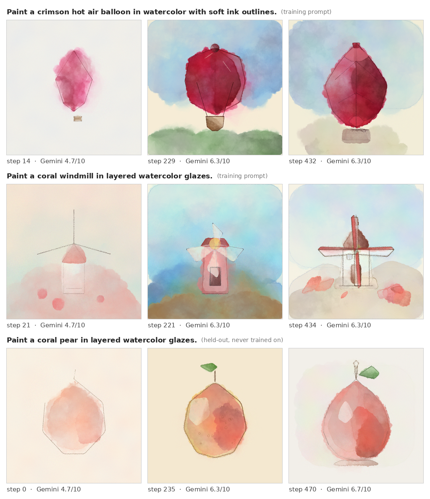
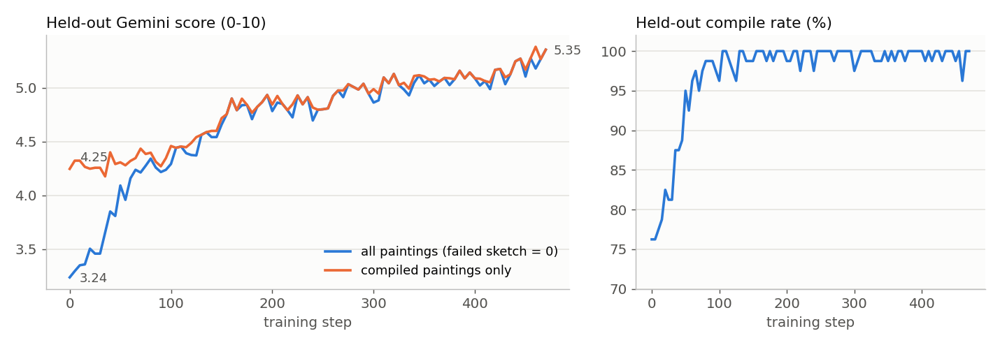
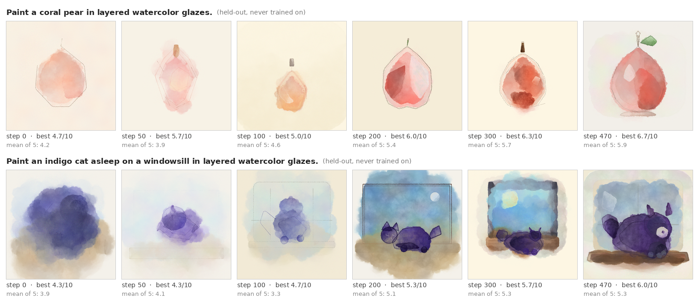

# paint_rl: RL for painting with code, rewarded by a multimodal LLM-as-a-Verifier

`Inkling-Small` learns to paint watercolors by writing
[p5.brush](https://github.com/acamposuribe/p5.brush) sketches. Each sketch is rendered
headlessly to a PNG. The paintings in a rollout group are compared against each other by
a multimodal verifier, and group-centered rewards update the policy on Tinker. An
LLM-as-a-Judge baseline (`reward_mode=judge`) scores each painting on its own instead,
under otherwise identical settings. The task
follows ["Training AI to Paint with Code"](https://surya.website/rling-qwen-to-paint-with-code);
the reward follows [LLM-as-a-Verifier](https://github.com/llm-as-a-verifier/llm-as-a-verifier).



*From the run described under [Results](#results): two training prompts as they
came round during the run, and one held-out prompt (never trained on) at three
checkpoints. Each cell is the best of that step's five paintings by Gemini score.*

## Models

| Role | Model | How |
|---|---|---|
| Policy | `thinkingmachines/Inkling-Small` | LoRA rank 32 on Tinker, `tml_v0` renderer, thinking effort 0.7, 8k-token budget |
| Training reward (`reward_mode=verifier`, default) | `thinkingmachines/Inkling-Small` | Self-verification with `llm_verifier.compare` over Tinker's OpenAI-compatible endpoint, thinking effort 0.2, token logprobs, 2 repeats |
| Training reward (`reward_mode=judge`) | `thinkingmachines/Inkling-Small` | LLM-as-a-Judge: same endpoint, thinking effort 0.2, one absolute 1-10 score per painting on a single overall criterion |
| Held-out evaluator | `moonshotai/Kimi-K2.6` | Tinker's native sampler; the judge's prompt, one absolute 1-10 score per held-out painting; never part of the reward |

## Quickstart

```bash
git clone https://github.com/jackyk02/paint_tinker.git && cd paint_tinker
cp .env.example .env && $EDITOR .env   # TINKER_API_KEY (everything runs on Tinker)
set -a && . ./.env && set +a
./setup.sh                             # vendored cookbook + paint-rl extra + Chromium

# Train with LLM-as-a-Verifier
python -m tinker_cookbook.recipes.paint_rl.train reward_mode=verifier log_path=/tmp/paint_rl/verifier
# ... and/or the LLM-as-a-Judge baseline (separately, or at the same time in another shell)
python -m tinker_cookbook.recipes.paint_rl.train reward_mode=judge log_path=/tmp/paint_rl/judge

# In another shell per run: evaluate every checkpoint on the held-out prompts as it appears
python -m tinker_cookbook.recipes.paint_rl.eval_checkpoints log_path=/tmp/paint_rl/verifier
python -m tinker_cookbook.recipes.paint_rl.eval_checkpoints log_path=/tmp/paint_rl/judge

# Compare the two on the held-out score, tie rate and training curves
python -m tinker_cookbook.recipes.paint_rl.compare_runs \
    runs='{"verifier": "/tmp/paint_rl/verifier", "judge": "/tmp/paint_rl/judge"}' out=compare.png
```

Every knob is in
[`train.py`](tinker-cookbook/tinker_cookbook/recipes/paint_rl/train.py); the recipe's
[README](tinker-cookbook/tinker_cookbook/recipes/paint_rl/README.md) covers the design.

## Defaults

| | |
|---|---|
| Steps | 200, each 8 prompts x 5 rollouts |
| Optimizer | importance-sampling policy gradient, group-centered advantages, lr 4e-5 |
| Reward | `0.05 * compiled + 0.05 * length_ok + 0.90 * score`, in both modes |
| Verifier | effort 0.2; 3 criteria x 2 slot-swapped repeats, full round robin: 60 calls per group, a whole step (480) in flight |
| Judge | effort 0.2; 1 call per painting, integer 1-10 -> `(s - 1) / 9`; tied paintings get equal reward; `scorer/top_tie` logs how often a group's top score is tied |
| Prompts | 1400: 43 subjects x 8 colors x 4 styles, plus 8 skill prompts x 4 styles; 256 training, 50 held-out spread over every subject |
| Rendering | 40 sketches at once (one step), ~4 pages per headless browser |
| Checkpoints | every 10 steps, kept on Tinker indefinitely |
| Held-out evaluation | separate process, base model + every checkpoint, 50 prompts x 5 paintings, one Kimi-K2.6 call per painting (250 per checkpoint, all in flight) |

## How it works

1. **Prompt.** For example, `Paint a teal field of flowers on a rolling hillside in
   wet-on-wet watercolor wash.` Most prompts are a subject x color x style: 43 subjects
   drawn from what watercolorists commonly paint (flowers, still-life objects, scenes and
   two animals, across three difficulty tiers), 8 colors and 4 styles. A few are
   fully worded skill prompts that test counting, spatial relations, shape and
   perspective, such as `Paint exactly five red tulips in a vase, in layered watercolor
   glazes.`; they make up about a tenth of training. The 256 training prompts are
   balanced over subjects, colors and styles; the 50 held-out prompts are spread over
   every subject and are never trained on. `prompts.py` has the pool and
   `prompts_test.py` pins the split.
2. **Sketch.** The policy replies with one `javascript` block that defines `setup()` on a
   512x512 WEBGL canvas, using only an allow-list of about 20 brush calls. The page
   renders one frame and stops the draw loop itself.
3. **Render.** Headless Chromium with software WebGL and pinned p5 1.11.3 / p5.brush 1.1.4.
   A sketch *compiles* if it throws no error, makes at least three distinct `brush.*`
   drawing calls, and paints a non-blank canvas.
4. **Score.** *Verifier:* every pair of compiled paintings in a group is compared on one
   criterion at a time (content fidelity, color and style fidelity, watercolor craft and
   composition), twice, with the two slots swapped on the second so position bias cancels. The verifier
   grades each painting A-T, and the score is the *expected* grade under its token
   probabilities, not the sampled letter. A painting's score is its mean over the
   comparisons it took part in. *Judge:* each compiled painting is scored once, 1-10, on
   one overall criterion. In both modes, sketches that did not compile score 0 and sit
   out.
5. **Update.** Rewards are centered within each group and fed to an importance-sampling
   policy gradient (`tinker_cookbook/rl/train.py`).

## Results

These results come from an earlier version of the recipe, with a different prompt pool,
8 prompts x 5 rollouts per step and `gemini-3.8-flash` as the held-out evaluator, so they
are not comparable with runs under the current defaults. The run was extended past 300 steps (`max_steps=1000`); numbers are at
step 470. Held-out: 16 prompts never trained on x 5 paintings per checkpoint, scored by
Gemini, which never sees training. Gemini gives each painting an
integer 0-10 on each of the three criteria; a painting's score is the mean of the three
(hence 4.7, 6.3), and the curves average 80 paintings per checkpoint.





*Two held-out prompts at six checkpoints. Each cell is the best of that checkpoint's five
paintings by Gemini score, with the mean of all five below it.*

| Held-out | step 0 (base) | step 470 |
|---|---|---|
| Gemini score, all paintings (failed sketch = 0) | 3.24 / 10 | 5.35 / 10 |
| Gemini score, compiled paintings only | 4.25 / 10 | 5.35 / 10 |
| Compile rate | 76% | 100% |
| Novel subjects / novel combinations | 3.30 / 3.17 | 5.36 / 5.35 |
| Tier 1 / 2 / 3 (single subject / in a setting / two elements) | 3.61 / 3.30 / 2.67 | 5.59 / 5.46 / 4.88 |

- **Quality kept rising after compiling was solved.** The compile rate reaches ~100% by
  step 100; the compiled-only Gemini score is flat until then and keeps climbing after it
  (4.25 -> 5.35), so the later gain is painting quality, not fewer failures.
- **It generalizes to unseen subjects.** Novel-subject prompts improve as much as novel
  combinations of seen ones.
- **The verifier stayed healthy.** 0% of verifier calls failed over the run. Its own grade
  of compiled paintings rose from 0.75 to 0.91 (first vs last 10 steps), moving in the same
  direction as Gemini.
- **Sketches got longer.** Mean code length grew from ~1.7k to ~6.7k characters (the
  length gate allows up to 8k), and a step now takes ~5 min instead of ~2. Policy entropy
  fell from 0.39 to 0.26.

`results/run/` holds the run's `config.json`, training `metrics.jsonl` and
`heldout_metrics.jsonl`.

## Outputs

Under `<log_path>/`:

| Path | Content |
|---|---|
| `metrics.jsonl` | training metrics per step |
| `checkpoints.jsonl` | every saved checkpoint, with its Tinker `sampler_path` |
| `paintings/train/step_XXXX/<prompt id>/` | each rollout's `.png`, `.js` and raw response, plus `group.json` with every verifier score |
| `paintings/index.jsonl` | one row per rollout: reward, score, compile result, paths |
| `iteration_XXXXXX/` | the cookbook's per-step HTML report and rollout summaries |
| `heldout_eval/metrics.jsonl` | held-out metrics per evaluated checkpoint; headline `test/env/all/eval_strong/score` (Kimi) |
| `heldout_eval/paintings/` | the held-out paintings, filed by checkpoint step |

Judge progress by the held-out Kimi score: the verifier's reward is relative to the other
paintings in a group and the judge's is on its own scale, so neither is comparable across
steps or between the two modes. `gallery.py`, `progression.py` and `compare_runs.py` turn
the outputs into an HTML gallery, per-step best-painting sheets and comparison curves
(`compare_runs.py` includes the held-out score and the top-score tie rate).

## Repository layout

| Path | Content |
|---|---|
| `tinker-cookbook/` | [tinker-cookbook](https://github.com/thinking-machines-lab/tinker-cookbook), vendored from upstream `e6fa1cc`, with the recipe and a `paint-rl` dependency extra added |
| `tinker-cookbook/tinker_cookbook/recipes/paint_rl/` | the recipe |
| `setup.sh` | installs the vendored cookbook with the `paint-rl` extra (`llm-verifier`, `openai`, `playwright`) and Chromium |
| `.env.example` | the credentials the run needs |
| `results/` | figures, metrics and config of the run above |
